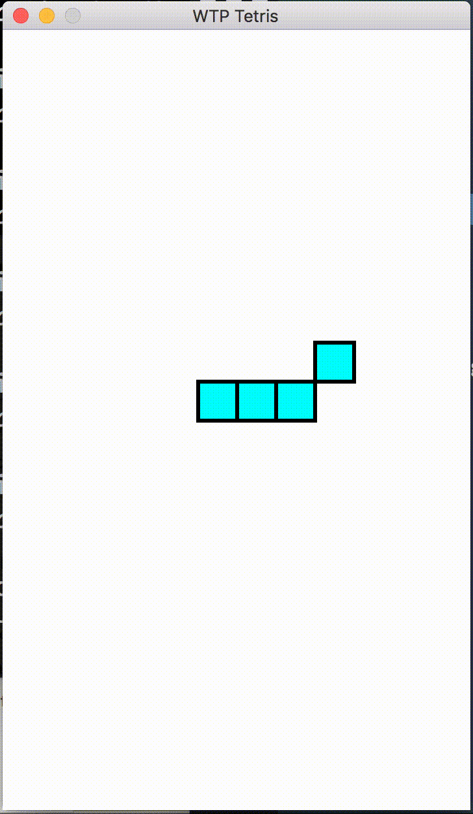

# WTP CS Problem Set 9.1 - Tetris: Day 1

To get started, log into your Edmodo student account, find the post for problem set 9.1, and download the files. You will also need your `tetrominoes.py` code from problem set 7. Copy your `tetrominoes.py` code into the folder for problem set 9.1.

### 1. Gamify Everything
We  need  to  keep  track  of  some  things  about  the  game,  such  as:

  * what  window  we're  currently  drawing  in
  * what  shape  is  currently  dropping
  * what  blocks  might  be  in  the  way  of  dropping  futher
  
 We  could  use  global  variables  for  this,  but  it's  better  to  pass  these  variables  in  as  parameters  to  the  classes  that need  to  know  about  them.  We  could  write  a  function  that  makes  the  variables  and  passes  them  to  various  classes, but  it  could  end  up  being  a  lot  of  variables  and  parameters.  Instead,  let's  make  a  `Game`  class!  That  way,  we  can  pass  a single  variable  (an  object  of  the  class  `Game`)  that  knows  about  everything  we  need  to  keep  track  of.
 
Write  a  `Game`  class in `tetrominoes.py`.  It  should  keep  track  of:
  
  * cols,  type  int:  number  of  columns  (in  coordinates,  not  pixels)
  * rows,  type  int:  number  of  rows  (in  coordinates,  not  pixels)
  * win,  type  GraphWin:  the  window  (whatever  GraphWin  object  you're  drawing  in)
  * current_shape,  type  Shape:  current  Shape  in  the  game  (whatever  Shape  object  is  currently  dropping).
  
Because  each  `Game`  object  should  have  its  own  window  and  pick  its  own  shapes  to  drop,  these  should  be  instance variables  but  not  parameters.  However,  we  want  to  be  able  to  make  a  new  game  of  any  size,  so  `cols`  and  `rows` should  be  parameters.  That  means  that  your  `__init__`  function  for  `Game`  should  be  defined  as  `__init__(self,cols,rows)`,  but  you  should  make  the  additional  attributes  `win`  and  `current_shape`  inside  the  `__init__`  function.
 
### 2. Make it Stop
Shapes  shouldn't  be  able  to  move  off  the  edge  of  the  window.  Add  a  `can_move`  method  to  both  your  `Shape`  class  and your  `Block`  class.  The  method  should  take  in  the  parameters  `dx`  and  `dy`,  just  like  `move(dx,dy)`  does.  It  should  return a  boolean:  `True`  if  the  shape/block  can  call  `move(dx,dy)`  without  falling  off  a  side  of  the  window,  or  `False`  if  it  can't. Again,  `dx`  and  `dy`  are  distances  in  coordinates,  not  pixels.

*Hint:  You  can  add  more  parameters  if  you  need  them,  either  to  this  function  or  to  any  other.*

In  order  to  do  this,  you'll  need  to  tell  your  blocks  and  shapes  how  big  the  window  is.  It's  up  to  you  to  figure  out  how  to get  the  information  from  your  `Game`  object  to  the  blocks  and  shapes  on  it.  Just  don't  use  global  variables!  We  don't want  to  accidentally  change  how  big  the  window  is  in  one  function  and  have  it  break  everything.

*Note:  Don't  worry  yet  about  this  function  telling  you  if  the  shape  is  going  to  run  into  a  different  shape.  That's  for tomorrow!*
 
### 3. Put it together
Finally,  write  a  method  for  `Game`  called  `add_drop_shape(shape_letter)`.  It  should  take  a  letter  from  the  list ["I","J","L","O","S","T","Z"],  make  a  shape  according  to  that  letter,  draw  the  shape  at  the  middle  of  the  top  of  the window,  and  drop  it  down  until  it  hits  the  bottom.

This  should  only  work  if  problems  1 and  2 are  also  working.  We  can't  give  you  code  to  test  how  your  earlier problems  are  doing  because  you  have  so  much  freedom  for  what  the  fuctions  might  look  like.  However,  we recommend  that  you  test  each  piece  of  your  code  and  make  sure  that  it  does  what  you  expect  it  to  do  with  various inputs.

*Hint:  Tetris  usually  pauses  briefly  after  each  drop  of  the  shape.  You  can  import  the  `time`  module  and  use  the  function `time.sleep(seconds)`  to  make  your  dropping  shape  pause  as  it  drops.*
 
### 4. Testing
Run the following code to test your program:
```python
from graphics import *
from tetris import *
 
game = Game(12,20)
shape_letter_list = ["I","J","L","O","S","T","Z"]
 
for shape in shape_letter_list:
    game.add_drop_shape(shape)
```

The  output  should  look  like this:


### Submitting your PSET
After you’ve finished your PSET, log into your Edmodo account, find the post for Problem Set 8.1, click "Open Assignment", attach all of the files that you created or edited for Problem Set 8.1, and then click "Turn in Assignment". You can resubmit the assignment as many times as you'd like. After you turn in your assignment, you're all done!
